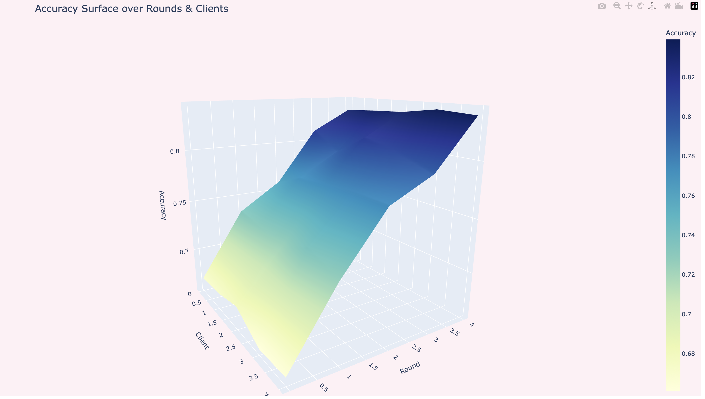
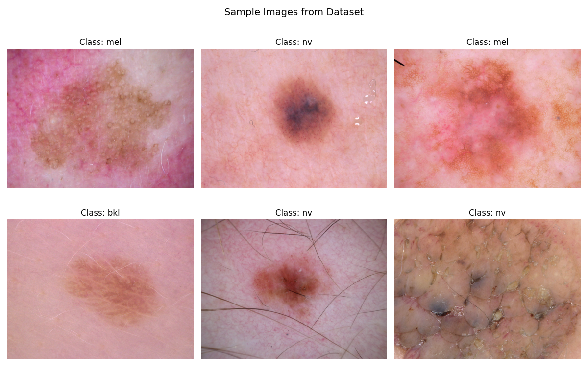

# Federated Skin Cancer Detection Using CNNs and FedOPT Optimization  
*A Privacy-Preserving Dermatology AI Framework with Client-Level Metric Tracking and 3D Learning Dynamics*

[](https://www.youtube.com/watch?v=MXLK5_ibPKw&list=LL&index=264&t=1863s)

---

## 📌 Overview  
This repository presents a **Federated Learning (FL)** framework for **skin cancer classification** using the **HAM10000 dermatology dataset**.  
The system simulates multi-institution collaboration while preserving data privacy, using:

- **Convolutional Neural Networks (CNNs)**
- **Flower Federated Learning Framework**
- **FedOPT Optimization Strategy**
- **Client-Level Upsampling for Class Imbalance**
- **3D Surface Visualizations** for training dynamics across rounds and clients  

This project was also featured in a **Flower Monthly Guest Talk (Aug 2025)**.

---

## 🚀 Key Features  
- **Federated Learning Simulation** with 5 clients  
- **FedOPT optimizer** for stable convergence in heterogeneous data settings  
- **Lightweight CNN** architecture optimized for dermoscopic image analysis  
- **Class imbalance mitigation** through client-specific upsampling  
- **Client-level metric tracking** (loss + accuracy per round, per client)  
- **3D visualization surfaces** for:
  - Training loss  
  - Validation loss  
  - Accuracy evolution  
- **ROC analysis** for all 7 HAM10000 lesion categories  

---

## 📊 Results Summary  

### 🔹 **3D Accuracy Surface (Across Clients & Rounds)**


### 🔹 **3D Loss Surface**


### 🔹 **Multi-Class ROC Curve**


### 🔹 **Sample HAM10000 Images**


The FedOPT strategy demonstrated **stable convergence**, **improved accuracy**, and **reduced variance** across clients compared to FedAvg.

---

## 🧠 Technical Architecture  

### **1. Dataset: HAM10000**
- 10,015 dermoscopic images  
- 7 diagnostic categories  
- Non-IID split across 5 clients  

### **2. Model Architecture (CNN)**
- Conv2D → ReLU → MaxPool  
- Conv2D → ReLU → MaxPool  
- Conv2D → ReLU → MaxPool  
- Fully Connected Layers  
- CrossEntropy Loss  
- Adam Optimizer  

### **3. Federated Learning Setup**
- **Framework:** Flower  
- **Clients:** 5 simulated clients  
- **Rounds:** 5 federated rounds  
- **Local Epochs:** 3 per round  
- **Batch Size:** 32  

### **4. FedOPT Server Optimizer**
eta = 0.01 # server learning rate
eta_l = 0.001 # client-side LR
beta_1 = 0.9
beta_2 = 0.999
tau = 1e-9


### **5. Class Imbalance Mitigation**
Each client dataset is upsampled to match the majority class count.

---

## 📂 Repository Structure
```plaintext
FederatedLearning/
│
├── code/
│ ├── FederatedLearning_FedAVG.py
│ └── FederatedLearning_FedOPT.py
│
├── results/
│ ├── Accuracy.png
│ ├── Loss.png
│ └── ROC Curve.png
│
├── whitepaper/
│ ├── FedOPT Whitepaper.pdf
│ └── Figure_1.png
│
└── README.md
```

---

## 🛠 Installation & Usage

### **1. Clone the repository**
```bash
git clone https://github.com/priyankadas1109/FederatedLearning.git
cd FederatedLearning
```

### **2. Create environment**
```bash
pip install -r requirements.txt
```
### **3. Run FedOPT Training**
```bash
python code/FederatedLearning_FedOPT.py
```
### **4. Run FedAvg Baseline**
```bash
python code/FederatedLearning_FedAVG.py
```
The scripts will generate all loss, accuracy, and ROC visualizations automatically.

---


## 📄 Whitepaper

The detailed whitepaper describing methodology, experiments, and evaluation is available here:
### 📎 FedOPT Whitepaper


---


## 🧬 Use Cases

This framework can be extended for:

- Privacy-preserving dermatology diagnostics

- Hospital collaboration without patient data sharing

- Benchmarking optimizers for federated medical imaging

- Research on non-IID learning dynamics

- AI governance and healthcare compliance studies

---


## ⭐ Author

Priyanka Das
AI/ML Solutions Architect | Federated Learning Researcher
Guest Speaker – Flower Labs (Aug 2025)

🔗 GitHub: https://github.com/priyankadas1109

🔗 LinkedIn: https://www.linkedin.com/in/priyanka-das/

---


## 📚 Citation
[](#citation)

```bibtex
@article{das2025federated,
  title={Federated Skin Cancer Detection Using CNNs and FedOPT Optimization: 
         A Privacy-Preserving Dermatology AI Framework},
  author={Das, Priyanka},
  journal={arXiv preprint arXiv:xxxx.xxxxx},
  year={2025},
  url={https://github.com/priyankadas1109/FederatedLearning}
}

```

---

## 🧪 Research Recognition

This project was presented as a guest speaker session at the Flower Monthly community event.  
[Watch the presentation →](https://www.youtube.com/watch?v=MXLK5_ibPKw&list=LL&index=264&t=1863s)

---

## 📝 License

This project is released for research and educational purposes.
